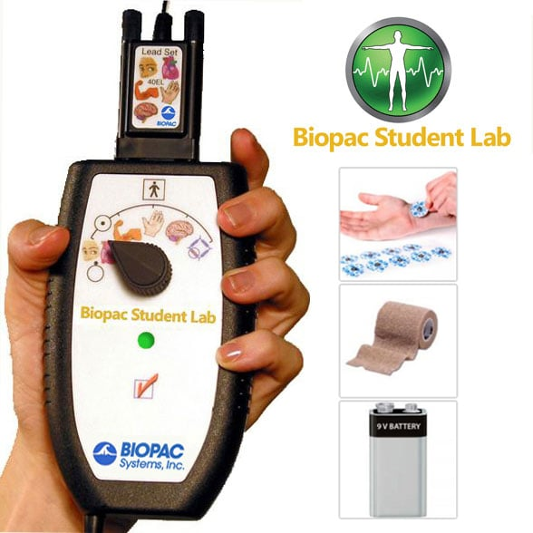

# Estudio de estado de ánimo

## Contenido
- [Estudio de estado de ánimo](#estudio-de-estado-de-ánimo)
  - [Contenido](#contenido)
  - [Dispositivos](#dispositivos)
  - [Pruebas de estado de ánimo](#pruebas-de-estado-de-ánimo)
  - [Audios](#audios)
  - [Código](#código)

## Dispositivos 
Para la realización de esta investigación se utiliza el dispositivo BIOPAC MP41. Este dispositivo cuenta únicamente con un canal para la recolección de señales bioeléctricas. Dentro de las señales bioeléctricas que puede captar se encuentran las señales EMG, EOG, ECG y EEG. El dispositivo tiene una frecuencia de muestreo de 1000 Hz.

    

El kit del dispositivo incluye el colector de señales MP40, una banda adhesiva y una batería de 9V.

Este dispositivo se utiliza en el estudio ya que tiene ventajas frente al ElectroCap, ya que dentro de su interfaz se puede visualizar las bandas alpha, beta, theta y delta luego de realizar la captura de las señales, además de ello al ser un dispositivo *recientemente adquirido* no presenta el desgaste que presenta el ElectroCap.

Cabe recalcar que el dispositivo tiene sus limitantes:
- No es capaz de capturar más de 30 minutos de actividad.
- No es capaz de comunicarse con otros lenguajes de programación.

Se encontró esta librería de Python en la cual realiza la conexión de los sistemas BIOPAC MP150, MP160 y MP36R con dicho lenguaje de programación, sin embargo, se debe de utilizar un archivo mpdev.dll el cual no se ha desarrollado, y por una respuesta del soporte técnico de la misma empresa, este no se desarrollará.

Se dispone de un [manual](/Manuales/L03%20Procedure-es.pdf) para el uso de este dispositivo, en él se encuentra una serie de pasos, tanto para la colocación del dispositivo como para el uso del software para la recolección de datos.

## Pruebas de estado de ánimo
Se tomó en cuenta el último minuto de la prueba de concentración de operaciones aritméticas mentales, dado que algunos estudios sugieren que este tipo de pruebas producen estrés.

Además de ello se realizó una prueba con la reproducción de algunos videos que incitaban diferentes estados de ánimo, entre ellos alegría, tristeza y frustación. Los vídeos utilizados se encuentran en la siguiente tabla.

<table>
    <thead>
        <tr>
            <th>Estado de ánimo</th>
            <th>Vídeo</th>
        </tr>
    </thead>
    <tbody>
        <tr>
            <td rowspan=2 align="center">Alegría</td>
            <td align="center">Fragmento de la película de Norbit - Escena de Rasputia en el tobogán</td>
        </tr>
        <tr>
            <td align="center">Mini aventuras de Winnie de Pooh - La gimnasia de Pooh</td>
        </tr>
        <tr>
            <td align="center">Frustración</td>
            <td align="center">Fragmento de episodio de la serie animada Bob Esponja - Las crónicas del autobús</td>
        </tr>
        <tr>
            <td rowspan=2 align="center">Tristeza</td>
            <td align="center">Fragmento de la película Marley y Yo - escena de la muerte de Marley</td>
        </tr>
        <tr>
            <td align="center">Fragmento de la película Up: una aventura de altura - introducción de la película, la historia de Carl y Ellie.</td>
        </tr>
    </tbody>
</table>

Dado que no se puede reproducir los pulsos binaurales mientras se está reproduciendo un vídeo u otro contenido de multimedia se recurrió a la lectura de historias/cuentos cortos para producir los mismos estados de ánimo. Los mismos están listados en el siguiente cuadro.

|Estado de ánimo|Lectura|
|---------------|-------|
|Alegria|Andrea y Giovanni - Roberto Fontanarrosa|
|Frustración| El ruiseñor y la rosa - Oscar Wilde|
|Tristeza|La niña de los fósforos - Hans Christian Andersen|

## Audios
Dentro de esta carpeta se encuentra el audio reproducido mientras se realizaba la prueba de estado de ánimo con las lecturas anteriormente descritas. Este contiene ruido rosa con pulsos binaurales con una frequencia central de 220 Hz, y una frecuencia de pulso binaural de 10 Hz.

## Código
Dentro de la carpeta de código se cuenta con todo el código empleado para realizar los distintos algoritmos de agrupamiento, al igual que se encuentra el código correspondiente para extraer las características de los datos recolectados para las diferentes pruebas.