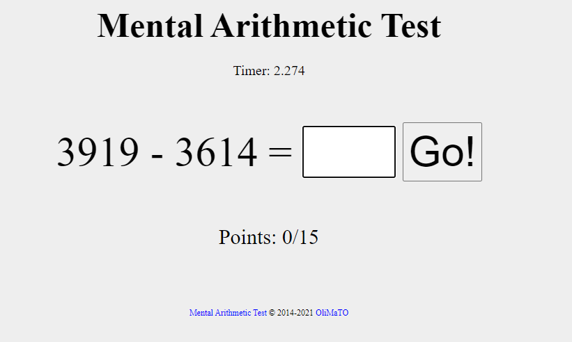
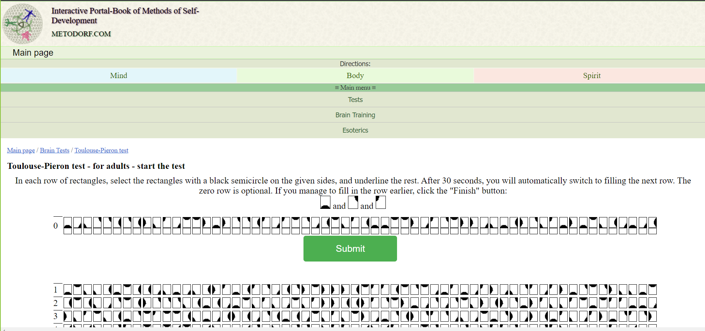

# Aplicación de técnicas de aprendizaje automático en señales bioeléctricas para el estudio del impacto de pulsos binaurales en estado de ánimo, concentración y calidad de sueño.
En este repositorio se encuentran todos los datos y el código utilizado para realizar los modelos de ML para el desarrollo de la investigación, asimismo se incluyen manuales para el uso de los dispositivos BIOPAC y ElectroCap con la Cyton Board.

## Contenido
1. [Sueño](#sueño)
2. [Concentración](#concentración)
3. [Estado de ánimo](#estado-de-ánimo)
4. [Manuales](#manuales)
5. [Modelos de machine learning](#modelos-de-machine-learning)
6. [Librerías](#librerías)

## Sueño
Dentro de la carpeta sueño se encuentra todo lo relacionado a este estudio, desde los datos utilizados en primera instancia para replicar y mejorar el aprendizaje automático realizado en la fase anterior, así como los datos extraídos para realizar la validación y el algoritmo de agrupamientos. Dicho esto, también se encuentran los códigos correspondientes para la realización del modelo de machine learning y los algoritmos de agrupamiento.

## Concentración
Dentro de esta carpeta se encuentra todo lo relacionado a este estudio, desde los datos extraídos así como los modelos ML utilizados. Para la extracción de datos se utilizaron varias pruebas de concentración. La primera de ellas consta de la realización de operaciones aritméticas y la segunda consta de identificar 3 figuras en una serie de figuras.

    
    

## Estado de ánimo
Su contenido abarca los datos recolectados y la programación para la realización de los diferentes algoritmos de agrupación. Para la realización de esta investigación se tomó el último minuto de la primera prueba de concentración, ya que este produce mucho estrés, y también se tomaron datos de sujetos de prueba visualizando varios vídeos emocionales los cuales incitan los siguientes estados de ánimo:

- Alegría
- Frustración
- Tristeza

Para validar el efecto de los pulsos binaurales que se producen en los diferentes estados de ánimo es necesario que el medio por el que se incitan los mismos no tengan audio, para producir adecuadamente los pulsos binaurales, por ello se recurrió a la lectura de historias/cuentos cortos.

## Manuales
Dentro se encuentran los manuales de uso de los siguientes dispositivos:
- ElectroCap con Cyton Board de OpenBCI 
- Biopac MP41

## Modelos de machine learning
Durante el estudio se aplicaron diferentes algoritmos de ML. Entre ellos está el SVM, Random Forest, KMeans Clustering, Agglomerative Clustering y DBSCAN Clustering.

### SVM (support vector machine)
La máquina de soporte de vectores es un algoritmo de aprendizaje supervisado que realiza una separación entre los datos mediante el valor de sus características. El algoritmo crea uno o varios límites, líneas de separación, entre dos o más clases. El límite se ve acompañado de un margen, este es el espacio que hay entre las dos clases y el límite. 

El límite también puede ser modificado para ignorar clases clasificadas erróneamente a través del hiperparámetro C.

### Random Forest
El algoritmo bosque aleatorio es un algoritmo de aprendizaje supervisado que está constituido por varios árboles de decisión. Estos árboles están construidos por la selección aleatoria de datos de entrenamiento y por un subconjunto de características de entrada. La predicción final es generada por la combinación de todas las predicciones de los árboles.

Uno de los problemas de los algoritmos de aprendizaje automático es el *sobre-ajuste*, el cual se relaciona con la exactitud en la predicción que, a su vez, pueda estar relacionado con la selección de los datos de entrenamiento. Como se realiza una construcción de cada árbol con datos aleatorios de entrenamiento, el sobre-ajuste no resulta ser un inconveniente para este tipo de clasificador.

### K Means Clustering
El algoritmo k-means es un método de agrupamiento que divide un conjunto de datos en k grupos o clusters. Los datos se agrupan de tal manera que los puntos en el mismo grupo sean más similares entre sí que los puntos en otros grupo. Mediante el parámetro K se establece la cantidad de grupos en los que los datos se van a agrupar.

### Agglomerative Clustering
La idea principal de este algoritmo es iniciar con cada punto de datos como un cluster individual y, en cada paso, combinar los clusters más cercanos hasta que todos los puntos de datos estén agrupados en un solo cluster. La información sobre cómo se combinan los clusters se almacena en una estructura llamada dendrograma, que es un árbol jerárquico que representa el proceso de agrupamiento.

### DBSCAN Clustering
DBSCAN, que significa "Density-Based Spatial Clustering of Applications with Noise," es un algoritmo de agrupamiento que se centra en identificar regiones densas de puntos en un espacio de características. A diferencia de algunos algoritmos de agrupamiento que asumen una forma específica de cluster o requieren la especificación previa del número de clusters, DBSCAN puede descubrir clusters de forma arbitraria y manejar de manera efectiva la presencia de ruido en los datos.

## Librerías
A continuación se enlistan las librerías que se utilizaron para realizar los algoritmos de ML.
- OS
- Pandas v2.0.3
- Numpy v1.24.4
- Matplotlib v3.7.2
- Seaborn v0.12.2
- Sklearn v1.3.0
- Collection v0.1.6
- Joblib v1.3.2
- PyEEG v0.4.4
- Scipy v1.10.1

Para la extracción de características de las señales se utiliza la librería PyEEG, en el cual hay un [paper](https://www.hindawi.com/journals/cin/2011/406391/) que explica más a detalle el significado y el cálculo de cada una de las características.