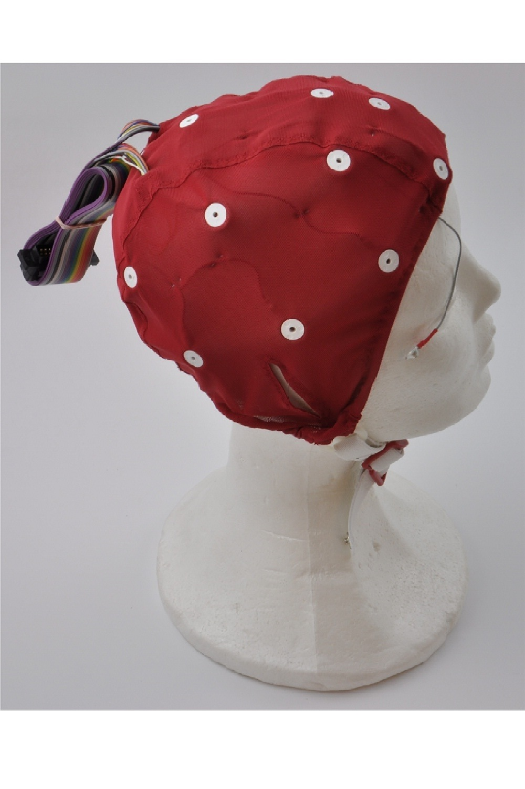
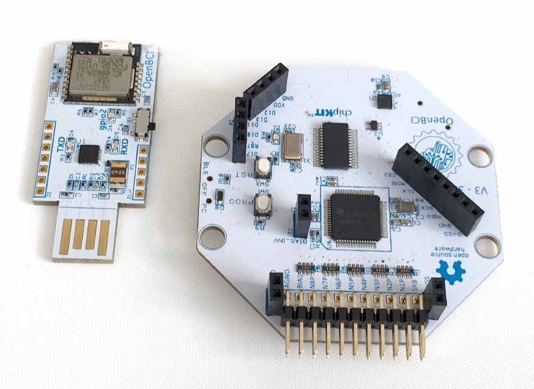

# Estudio del sueño

## Contenido
1. [Dispositivos](#dispositivos)
2. [Librerías](#librerías)
3. [Modelos de Machine Learning](#modelos-de-machine-learning)

## Dispositivos
Para el estudio del sueño se utilizó el dispositivo Electro-Cap con la Cyton Board de OpenBCI.

    
    

El ElectroCap es un gorro con 20 electrodos, estos están posicionados según el sistema internacional 10-20. Además del ElectroCap, se debe de utilizar sensores de oído como referencia de la señal.

La Cyton Board es un microcontrolador especializado en la recolección de señales bioeléctricas desarrollado por la empresa OpenBCI. Este cuenta con 8 canales de los cuales puede obtener señales bieléctricas. Este se conecta inalámbricamente (a través de Bluetooth) al dongle para transmitir la información hacia la computadora.

OpenBCI desarrolló un [programa](https://openbci.com/downloads) para la recolección de las señales bioeléctricas. Este programa se utilizó para la recolección de señales de sueño durante la investigación.

Pensando en el futuro progreso de la investigación, se desarrolló un [manual](/Manuales/Manual%20de%20uso%20del%20Electro%20Cap%20con%20OpenBCI.pdf) en el que se detalla su uso y conexión.

## Librerías
A continuación se enlistan las librerías que se utilizaron para realizar los algoritmos de ML.
- OS
- Pandas v2.0.3
- Numpy v1.24.4
- Matplotlib v3.7.2
- Seaborn v0.12.2
- Sklearn v1.3.0
- Collection v0.1.6
- Joblib v1.3.2
- PyEEG v0.4.4
- Scipy v1.10.1

Para la extracción de características de las señales se utiliza la librería PyEEG, en el cual hay un [paper](https://www.hindawi.com/journals/cin/2011/406391/) que explica más a detalle el significado y el cálculo de cada una de las características.

## Modelos de machine learning
Durante el estudio se aplicaron diferentes algoritmos de ML. Entre ellos está el SVM, Random Forest y KMeans Clustering

### SVM (support vector machine)
La máquina de soporte de vectores es un algoritmo de aprendizaje supervisado que realiza una separación entre los datos mediante el valor de sus características. El algoritmo crea uno o varios límites, líneas de separación, entre dos o más clases. El límite se ve acompañado de un margen, este es el espacio que hay entre las dos clases y el límite. 

El límite también puede ser modificado para ignorar clases clasificadas erróneamente a través del hiperparámetro C.

### Random Forest
El algoritmo bosque aleatorio es un algoritmo de aprendizaje supervisado que está constituido por varios árboles de decisión. Estos árboles están construidos por la selección aleatoria de datos de entrenamiento y por un subconjunto de características de entrada. La predicción final es generada por la combinación de todas las predicciones de los árboles.

Uno de los problemas de los algoritmos de aprendizaje automático es el *sobre-ajuste*, el cual se relaciona con la exactitud en la predicción que, a su vez, pueda estar relacionado con la selección de los datos de entrenamiento. Como se realiza una construcción de cada árbol con datos aleatorios de entrenamiento, el sobre-ajuste no resulta ser un inconveniente para este tipo de clasificador.

### K Means Clustering
El algoritmo k-means es un método de agrupamiento que divide un conjunto de datos en k grupos o clusters. Los datos se agrupan de tal manera que los puntos en el mismo grupo sean más similares entre sí que los puntos en otros grupo. Mediante el parámetro K se establece la cantidad de grupos en los que los datos se van a agrupar.